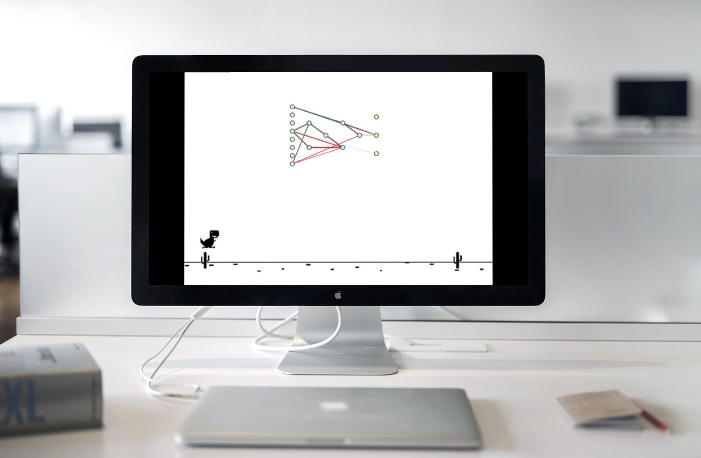

  <h1 align="center">
    <b>Hi there, I'm JawadAsif</b> 
    
  </h1>

  &nbsp;
<!-- &nbsp; -->
  &nbsp;
<!-- &nbsp; -->
  &nbsp;
<!-- &nbsp; -->

 

  <ul>
    <li>🔭 Enthusiastic Software Engineer.</li> 
    <li>🚀 Programming since 2011.</li>
    <li>🌱 Worked in both industry and academia.</li> 
    <li>💪 Developed  mobile, desktop and web apps.</li> 
    <li>💡 Taught CS and Programming Languages.</li>
    <li>🤝 Love to learn and teach.</li>
    <li>👀 Looking for freelance opportunities.</li>
  </ul>

  
 

<h2 align="center"> My favorite projects</h2>
 

  
  
  
  
  
  
  
  

 
 
 

  <h2 align="center"> Platforms and Frameworks</h2>

  &nbsp;
  &nbsp;
  &nbsp;
  &nbsp;
  &nbsp;
  &nbsp;
    &nbsp;
    &nbsp;

 

  <h3 align="center"> Languages and Tools</h3>

 

&nbsp;
&nbsp;
&nbsp;
&nbsp;
&nbsp;
&nbsp;
&nbsp;
&nbsp;
&nbsp;
&nbsp;
&nbsp;
&nbsp;
&nbsp;
&nbsp;
&nbsp;
&nbsp;
   

 
 
 
<h2 align="center">📊 My Github Stats</h2>
 

  
  
  

<b>Note:</b> Top languages is only a metric of the languages my public code consists of and doesn't reflect experience or skill level.
 
 
<!--  -->

 
 
 

   <em><b>I love connecting with different people</b> so if you want to say <b>hi, I'll be happy to meet you more!</b> 😊</em>

 

<h2 align="center">Connect with me</h2>

  
  <!--  -->
  
  

 
 
<!-- <h2 align="center">❤ Views and Followers</h2>

  
  

 -->

<!-- --- -->

<h2 align="center">📕 Latest Blog Posts</h2>

<!-- BLOG-POST-LIST:START -->
- [189. Rotate Array](https://blog.jawadasif.vercel.app/post/rotate-array)
- [84. Largest Rectangle in Histogram](https://blog.jawadasif.vercel.app/post/largest-rectangle-in-histogram)
- [211. Design Add and Search Words Data Structure](https://blog.jawadasif.vercel.app/post/design-add-and-search-words-data-structure)
- [421. Maximum XOR of Two Numbers in an Array](https://blog.jawadasif.vercel.app/post/maximum-xor-of-two-numbers-in-an-array)
- [1305. All Elements in Two Binary Search Trees](https://blog.jawadasif.vercel.app/post/all-elements-in-two-binary-search-trees)
<!-- BLOG-POST-LIST:END -->
... [READ MORE](https://blog.jawadasif.vercel.app)
